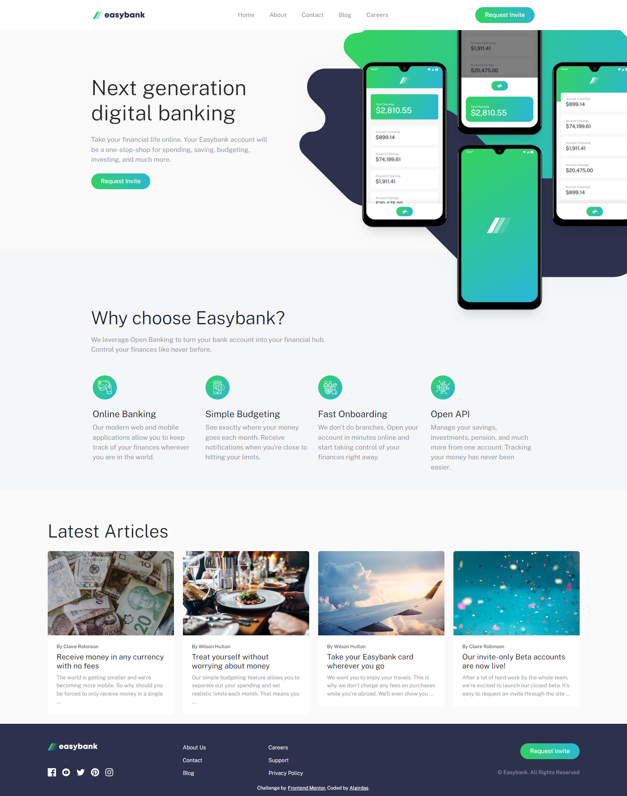
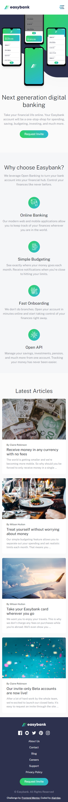

# Frontend Mentor - Easybank landing page solution

This is a solution to the [Easybank landing page challenge on Frontend Mentor](https://www.frontendmentor.io/challenges/easybank-landing-page-WaUhkoDN). Frontend Mentor challenges help you improve your coding skills by building realistic projects. 

## Table of contents

- [Overview](#overview)
  - [The challenge](#the-challenge)
  - [Screenshot](#screenshot)
  - [Links](#links)
- [My process](#my-process)
  - [Built with](#built-with)
  - [What I learned](#what-i-learned)
  - [Useful resources](#useful-resources)
- [Author](#author)

## Overview

### The challenge

Users should be able to:

- View the optimal layout for the site depending on their device's screen size
- See hover states for all interactive elements on the page

### Screenshot

### Links

- Solution URL: (https://github.com/AlgirdasU/Easybank-landing-page-master)
- Live Site URL: (https://darling-rolypoly-56b9cb.netlify.app/) 

## My process

### Built with

- Semantic HTML5 markup
- CSS custom properties
- SCSS
- Flexbox
- Mobile-first workflow
- BEM
- Bootstrap 5.2
- JS

### What I learned

I've been improving my Bootstrap with SCSS skills so I can work faster and cleaner.

### Useful resources

- [Example resource 1](https://www.youtube.com/watch?v=_MrShB9fh7U) - Animated Custom Hamburger Icon in Navbar in bootstrap 5 (with a gradient).

## Author

- Website - [Algirdas](https://github.com/AlgirdasU/Easybank-landing-page-master)
- Frontend Mentor - [@Algirdase](https://www.frontendmentor.io/home/my-challenges)
- Twitter - [@AlgirdasDdd](https://twitter.com/algirdasddd)

## Acknowledgments

